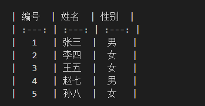

# 一级标题
## 二级标题
### 三级标题

插入目录
`Ctrl+Shift+p`打开palette，搜索content，然后选*Markdown All in One:Create Table of Contents*

- [一级标题](#一级标题)
  - [二级标题](#二级标题)
    - [三级标题](#三级标题)

代码块
``` bash
echo $HOME
```
``` python
# -*- coding: UTF-8 -*-

# Filename : helloworld.py
# author by : www.runoob.com

# 该实例输出 Hello World!
print('Hello World!')
```

正文中的代码`show ip interface brief`

有序列表
1. 123
   1. - abc
   2. - xyz
2. 456  
3. 789

无序列表
- 123
- 456
- 789

**加粗**和*倾斜*

插入链接
[google](https://www.google.com/)


创建表格
| 编号 | 姓名 | 性别 |
| :----: | :----: | :----: |
| 1    | 张三 | 男   |





1
- 1.1
  - 1.1.1
  - 1.1.2
- 1.2
- 
2
- 2.1
